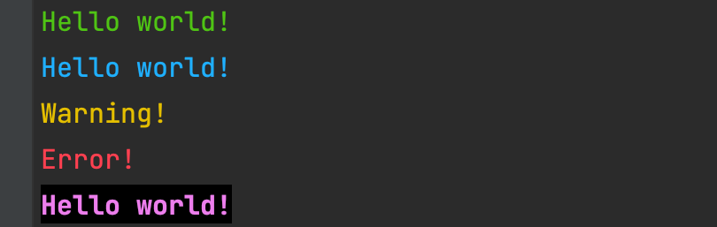

## Colors-cli

<p>
The colors-cli help you for backlight and formatting your cli text
</p>

### Usage:
```python
from colors_cli import Clrs

print(Clrs.green("Hello world!"))  # Output green text in cli

print(Clrs.blue("Hello world!"))  # Output blue text in cli

print(Clrs.warn("Warning!"))  # Output yellow color

print(Clrs.fail("Error!"))  # Output red color

print(Clrs.bold(Clrs.violet(Clrs.bckg("Hello world!"))))  # Output bold and violet with background text

```
#### Output



### All methods:

- ```green(string) -> str``` - Return green string
- ```blue(string) -> str``` - Return blue string
- ```cyan(string) -> str``` - Return cyan string
- ```warn(string) -> str``` - Return yellow string
- ```fail(string) -> str``` -  Return fail string
- ```violet(string) -> str``` - Return violet string
- ```bold(string) -> str``` - Return bold string
- ```underline(string) -> str``` - Return underline string
- ```bckg(string) -> str``` - Return string with background

### All fields:

- ```ENDC``` - For end color
- ```RED``` 
- ```BLUE```
- ```CYAN```
- ```GREEN``` 
- ```VIOLET```  
- ```YELLOW```
- ```BOLD``` 
- ```UNDERLINE``` 
- ```BACKGROUND```


#### Enjoy using! :)
